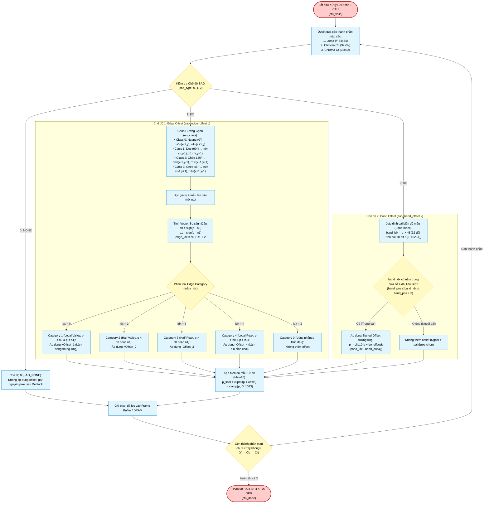

# Sample Adaptive Offset Subsystem (`sao_top`) — Algorithm & Hardware Flowchart

## 1. Subsystem Architecture & Responsibilities

The **Sample Adaptive Offset (SAO) Subsystem** ([`rtl/inloop_filters/sao_top.v`](file:///d:/UIT_Doc/hevc_hw_encoder/rtl/inloop_filters/sao_top.v)) is the secondary in-loop filter in HEVC (**Section 8.7.3**), executed immediately after the Deblocking Filter.

SAO reconstructs high-frequency details and reduces ringing and banding artifacts by classifying deblocked pixels into categories and adding conditional signed offsets:
1. **Edge Offset (EO)**: Classifies pixels based on directional edge gradients relative to 2 neighboring samples across 4 angular directions ($0^\circ, 90^\circ, 135^\circ, 45^\circ$).
2. **Band Offset (BO)**: Divides the sample amplitude range ($0..1023$ for 10-bit) into 32 equal bands ($32\text{ values/band}$) and applies signed offsets to 4 consecutive bands.
3. **Dedicated Submodules**:
   - **[`sao_edge_offset`](file:///d:/UIT_Doc/hevc_hw_encoder/rtl/inloop_filters/sao_edge_offset.v)**: Directional neighbor fetch, category calculation, and signed offset addition.
   - **[`sao_band_offset`](file:///d:/UIT_Doc/hevc_hw_encoder/rtl/inloop_filters/sao_band_offset.v)**: Amplitude band classification and band-selective offset addition.
   - **[`sao_stats`](file:///d:/UIT_Doc/hevc_hw_encoder/rtl/inloop_filters/sao_stats.v)**: Executes sequential full-CTU `Y -> Cb -> Cr` 32-band BO RDO (with causality border-skip on non-last CTUs, symmetric `[-15, +15]` offset clamp matching `syntax_sao.v` `cMax=31`, and `ctu_qp` 52-entry Q8 lambda LUT + Table 8-10 chroma QP) and last-CTU (`is_last_col && is_last_row`) 4-class EO RDO (`0°, 90°, 135°, 45°`) via an internal `64x10b` line buffer.

---

## 2. Algorithm Flowchart (Mermaid)

```mermaid
flowchart TD
    %% Node Styling
    classDef startend fill:#ffcccb,stroke:#b71c1c,stroke-width:2px,color:#000;
    classDef process fill:#e1f5fe,stroke:#0277bd,stroke-width:1px,color:#000;
    classDef decision fill:#fff9c4,stroke:#fbc02d,stroke-width:1px,color:#000;
    classDef storage fill:#dcedc8,stroke:#33691e,stroke-width:1px,color:#000;

    Start(["Bắt đầu Xử lý SAO cho 1 CTU<br/>(ctu_valid)"])
    End(["Hoàn tất SAO CTU & Ghi DPB<br/>(ctu_done)"])

    %% Component Loop
    CompLoop["Duyệt qua các thành phần màu sắc:<br/>1. Luma (Y 64x64)<br/>2. Chroma Cb (32x32)<br/>3. Chroma Cr (32x32)"]

    CheckSaoType{"Kiểm tra Chế độ SAO<br/>(sao_type: 0, 1, 2)"}

    %% Bypass Path
    BypassSAO["Chế độ 0 (SAO_NONE):<br/>Không áp dụng offset, giữ nguyên pixel sau Deblock"]

    %% Edge Offset (EO) Subgraph
    subgraph EO_Path ["Chế độ 1: Edge Offset (sao_edge_offset.v)"]
        SelectClass["Chọn Hướng Cạnh (eo_class):<br/>&bull; Class 0: Ngang (0&deg;) &rarr; n0=(x-1,y), n1=(x+1,y)<br/>&bull; Class 1: Dọc (90&deg;) &rarr; n0=(x,y-1), n1=(x,y+1)<br/>&bull; Class 2: Chéo 135&deg; &rarr; n0=(x-1,y-1), n1=(x+1,y+1)<br/>&bull; Class 3: Chéo 45&deg; &rarr; n0=(x-1,y+1), n1=(x+1,y-1)"]

        FetchNeighbors["Đọc giá trị 2 mẫu lân cận (n0, n1)"]

        CompareEdge["Tính Vector So sánh Dấu:<br/>s0 = sign(p - n0)<br/>s1 = sign(p - n1)<br/>edge_idx = s0 + s1 + 2"]

        ClassifyEdge{"Phân loại Edge Category<br/>(edge_idx)"}
        Cat1["Category 1 (Local Valley, p &lt; n0 &amp; p &lt; n1):<br/>Áp dụng +Offset_1 (Làm sáng thung lũng)"]
        Cat2["Category 2 (Half Valley, p &lt; n0 hoặc n1):<br/>Áp dụng +Offset_2"]
        Cat3["Category 3 (Half Peak, p &gt; n0 hoặc n1):<br/>Áp dụng -Offset_3"]
        Cat4["Category 4 (Local Peak, p &gt; n0 &amp; p &gt; n1):<br/>Áp dụng -Offset_4 (Làm dịu đỉnh chói)"]
        Cat0["Category 0 (Vùng phẳng / Dốc đều):<br/>Không thêm offset"]
    end

    %% Band Offset (BO) Subgraph
    subgraph BO_Path ["Chế độ 2: Band Offset (sao_band_offset.v)"]
        CalcBand["Xác định dải biên độ mẫu (Band Index):<br/>band_idx = p &gt;&gt; 5 (32 dải trên dải 10-bit &#91;0..1023&#93;)"]

        CheckBandInWindow{"band_idx có nằm trong<br/>cửa sổ 4 dải liên tiếp?<br/>(band_pos &le; band_idx &le; band_pos + 3)"}
        ApplyBO["Áp dụng Signed Offset tương ứng:<br/>p' = clip10(p + bo_offset&#91;band_idx - band_pos&#93;)"]
        BypassBO["Không thêm offset (Ngoài 4 dải được chọn)"]
    end

    %% Clip & Commit
    ClipSample["Kẹp biên độ mẫu 10-bit (Main10):<br/>p_final = clip10(p + offset) = clamp(p', 0, 1023)"]
    WritePixel["Ghi pixel đã lọc vào Frame Buffer / DRAM"]
    MoreComps{"Còn thành phần màu<br/>chưa xử lý không?<br/>(Y &rarr; Cb &rarr; Cr)"}

    %% Stream Connections
    Start --> CompLoop --> CheckSaoType

    CheckSaoType -- "0: NONE" --> BypassSAO --> WritePixel
    CheckSaoType -- "1: EO" --> SelectClass --> FetchNeighbors --> CompareEdge --> ClassifyEdge

    ClassifyEdge -- "Idx = 0" --> Cat1 --> ClipSample
    ClassifyEdge -- "Idx = 1" --> Cat2 --> ClipSample
    ClassifyEdge -- "Idx = 3" --> Cat3 --> ClipSample
    ClassifyEdge -- "Idx = 4" --> Cat4 --> ClipSample
    ClassifyEdge -- "Idx = 2" --> Cat0 --> ClipSample

    CheckSaoType -- "2: BO" --> CalcBand --> CheckBandInWindow
    CheckBandInWindow -- "Có (Trong dải)" --> ApplyBO --> ClipSample
    CheckBandInWindow -- "Không (Ngoài dải)" --> BypassBO --> ClipSample

    ClipSample --> WritePixel --> MoreComps
    MoreComps -- "Còn thành phần" --> CompLoop
    MoreComps -- "Hoàn tất cả 3" --> End

    %% Styling
    class Start,End startend;
    class CompLoop,BypassSAO,SelectClass,FetchNeighbors,CompareEdge,Cat1,Cat2,Cat3,Cat4,Cat0,CalcBand,ApplyBO,BypassBO,ClipSample,WritePixel process;
    class CheckSaoType,ClassifyEdge,CheckBandInWindow,MoreComps decision;
```

---

## 3. Mathematical Classification & Edge Categories (HEVC Table 8-13)

| Edge Index (`edge_idx`) | Condition ($p$ vs $n_0, n_1$) | Category Description | Valid Offset Range |
|:---:|:---:|:---|:---:|
| **0** | $p < n_0$ and $p < n_1$ | **Category 1**: Local Valley | $\ge 0$ (Positive offset) |
| **1** | $p < n_0, p = n_1$ or $p = n_0, p < n_1$ | **Category 2**: Concave corner / Half valley | $\ge 0$ (Positive offset) |
| **2** | $p = n_0, p = n_1$ or monotonic slope | **Category 0**: Flat or pure slope | 0 (No offset) |
| **3** | $p > n_0, p = n_1$ or $p = n_0, p > n_1$ | **Category 3**: Convex corner / Half peak | $\le 0$ (Negative offset) |
| **4** | $p > n_0$ and $p > n_1$ | **Category 4**: Local Peak | $\le 0$ (Negative offset) |

---

## 4. Hardware Interface Details (`sao_top.v`)

| Port Name | Dir | Width | Description |
|:---|:---:|:---:|:---|
| `clk`, `rst_n` | In | 1 | Clock and active-low reset. |
| `ctu_valid` | In | 1 | New CTU ready for SAO processing. |
| `ctu_ready` | Out | 1 | SAO unit ready to accept new CTU. |
| `ctu_x`, `ctu_y` | In | 10 | Frame coordinates of current CTU. |
| `frame_width_px`, `frame_height_px` | In | 12 | Active frame dimensions in pixels (used for right/bottom boundary gating). |
| `sao_type` | In | 6 | Packed $3 \times 2\text{-bit}$ type per component: $[1:0]=Y, [3:2]=Cb, [5:4]=Cr$. |
| `eo_class` | In | 6 | Packed $3 \times 2\text{-bit}$ direction class per component. |
| `eo_offset` | In | 75 | Packed $3 \times 5 \times 5\text{-bit}$ signed EO offsets. |
| `band_pos` | In | 15 | Packed $3 \times 5\text{-bit}$ starting band position per component. |
| `bo_offset` | In | 60 | Packed $3 \times 4 \times 5\text{-bit}$ signed BO offsets. |
| `pix_rd_*`, `n0_rd_*`, `n1_rd_*` | Out | — | Read request channels for center pixel and directional neighbors. |
| `pix_wr_*` | Out | — | Writeback channel emitting SAO filtered pixels to frame store. |
| `ctu_done` | Out | 1 | High pulse asserted when CTU SAO filtering finishes. |

---

## 5. End-to-End Bit-Exact Dynamic Multi-Mode SAO & CTU-Delayed CABAC Serialization (`T3-13`)

### 5.1. 2-Phase Single-Port BRAM Neighbor Read, `EO_45` Right-Border Guard & Neighbor BO Forwarding
In CTU-by-CTU hardware architectures, Edge Offset (EO) requires reading neighboring boundary pixels ($n_0, n_1$) that may cross CTU boundaries or undergo in-place write modification within single-port SRAM buffers.

To achieve **100% bit-exact reconstruction (`max_diff == 0`)** across all 3 frames (`I`, `P`, `B`) while dynamically executing `OFF`, `EO` ($0^\circ, 90^\circ, 135^\circ, 45^\circ$), and `BO`:
1. **2-Phase Single-Port BRAM EO Read (`SINGLE_PORT_BRAM_MODE = 1`) & `EO_45` Guard**: `sao_top.v` sequences `S_REQ_PIX` (reading center pixel $c$ and any cross-CTU $n_0$) $\to$ `S_REQ_N1` (reading $n_1$ from single-port BRAM while caching unmodified intra-CTU $n_0$ in `pre_sao_row_buf`, `cur_row_left`, and `prev_row_left_d`) $\to$ `S_WAIT_PIX`. For `EO_45` (`2'd3`), `sao_top.v` checks `if (scan_y == 6'd0 || scan_x == max_dim)` to drive `n0_rd_valid` with `(scan_x + 1, scan_y - 1)` so right-border top-right lookups resolve via `sao_n0_top_right` (`line_buf` when `has_right_ctu`) or signed `sao_n0_oob` / `sao_n1_oob` guards in `decoder_inloop_filters.v`.
2. **Pre-SAO Neighbor Buffers & Latched Neighbor BO Forwarding**: `decoder_inloop_filters.v` keeps `col_buf_*`, `line_buf_*`, and `corner_buf_*` strictly **post-deblocked, pre-SAO** (updated with post-DB samples during `S_DB`), and latches each finished CTU's BO parameters into `left_sao_*`, `top_left_sao_*`, and `top_sao_*[0:63]` at the end of `S_DUMP` (`dump_count_q == 6143`). Whenever cross-CTU deblocking asserts `db_pix_wr_neighbor` during `S_DB`, `decoder_inloop_filters.v` applies the latched neighbor CTU BO (`db_nbr_sao_pixel`) onto the DPB-bound `out_pixel` output **only**, leaving internal `col_buf_*`/`line_buf_*`/`corner_buf_*` uncorrupted for downstream CTUs.

### 5.2. Sequential Full-CTU `sao_stats.v` RDO (`Y -> Cb -> Cr` BO + Last-CTU EO)
1. **Full-CTU `Y -> Cb -> Cr` 32-Band BO RDO**: `sao_stats.v` sweeps components sequentially (`Y -> Cb -> Cr`) across 2-stage BRAM read alignment (`rd_req_d1 -> rd_req_d2` + `S_FLUSH`). On non-last CTUs, border pixels susceptible to right/bottom causal deblocking lag are skipped (`> 60` for Luma, `> 28` / `> 30` for Chroma); candidate offsets across cyclic 4-band windows (`bp0..bp3`) are clamped symmetrically to `[-15, +15]` (`iter_m <= 4'd15`, fitting inside `signed [4:0]` and `syntax_sao.v` `cMax = 31`). Rate-distortion scoring uses `ctu_qp` (with X/Z fallback to `29`), Table 8-10 `get_qpc` chroma QP mapping, and a 52-entry 10-bit Q8 lambda LUT (`get_lambda_q8`), evaluating independent Luma vs. joint `Cb + Cr` decisions (`syntax_sao.v` shared chroma `sao_type` / `eo_class`).
2. **Last-CTU 4-Class EO RDO (`is_last_col && is_last_row`)**: On the bottom-right CTU where no further causal CTUs depend on unmodified borders, `sao_stats.v` enables all 4 EO classes (`0°, 90°, 135°, 45°`) using internal `64`-entry `10-bit` line buffers (`row_m1_rec`, `row_m2_rec`, `row_m1_diff`) and a $3\times 3$ sliding window over interior pixels (`x >= 2, y >= 2`).

### 5.3. CTU-Delayed Bitstream Serialization (`ctu_bin_ram`, `SINGLE_PASS_CAUSAL_SYNC = 0`)
HEVC Clause 7.3.8.2 mandates that `sao(rx, ry)` syntax must be emitted at the start of each CTU before `coding_quadtree()`. During `S_FILL`, `cabac_enc_top.v` buffers `coding_quadtree()` bins (`syntax_cu`, `syntax_pred`, `syntax_coeff`) into `ctu_bin_ram` (`8192 x 10-bit`, `2 RAMB36 + 1 RAMB18`). Once `sao_stats_done` asserts after `S_STATS`, `syntax_sao.v` emits `sao(rx, ry)` **first**, and `ctu_bin_ram` drains into `bin_encoder` $\to$ `range_coder` with `drain_prefetched_valid` BRAM drain alignment.

